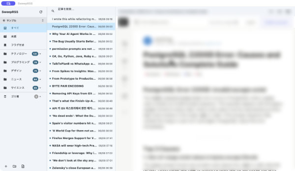

# SweepRSS

[日本語版はこちら](README.ja.md)

A cross-platform RSS reader built with Flutter.

## Screenshot



## Features

- **Spaces**: Switch between named workspaces (e.g. "Work", "Hobbies") — each space has its own folders and article feed
- **Feed management**: RSS / Atom / JSON Feed support. Add, edit, and delete feeds
- **Folder organization**: Organize feeds into folders. Drag and drop to move or reorder
- **Article list**: Filter by unread, flagged, all, folder, or individual feed
- **Article reader**: Rich article rendering via WebView
- **Persistent folder state**: Folder expand/collapse state survives app restarts
- **Trash**: Soft-delete feeds to the Trash. Right-click to restore or permanently delete
- **Auto-refresh**: Background feed polling every 60 seconds
- **OPML import / export**: Export all spaces or the current space. Compatible with other RSS readers
- **Internationalization**: English and Japanese UI
- **Security**: SSRF prevention and HTML sanitization

## Supported Platforms

| Platform | Status |
|---|---|
| macOS | ✅ Verified |
| iOS | 🔧 Planned |
| Android | 🔧 Planned |
| Windows | 🔧 Planned |
| Linux | 🔧 Planned |

## Tech Stack

| Category | Library |
|---|---|
| Framework | Flutter 3.44 / Dart 3.12 |
| State management | Riverpod 2.6 |
| Database | drift 2.28 (SQLite) |
| WebView | flutter_inappwebview 6.1 |
| RSS parsing | webfeed_plus |
| HTTP | dio |
| OPML | xml |

## Setup

### Requirements

- Flutter 3.44 or later
- macOS 13 or later (for macOS builds)
- Xcode 15 or later (for macOS / iOS builds)

### Build

```bash
# Install dependencies
flutter pub get

# Run on macOS
flutter run -d macos

# Code generation (drift / Riverpod)
flutter pub run build_runner build --delete-conflicting-outputs
```

## Project Structure

```
lib/
├── main.dart
├── app.dart                          # MaterialApp + PlatformMenuBar
├── core/
│   ├── database/                     # drift ORM (tables, DAOs, migrations)
│   │   ├── tables/                   # Spaces, Folders, Feeds, Entries table definitions
│   │   └── daos/                     # SpacesDao, FoldersDao, FeedsDao, EntriesDao
│   ├── models/                       # Selection sealed class
│   └── services/                     # RSS fetch, OPML parse, URL validation, HTML sanitize
├── features/
│   ├── sidebar/widgets/              # Sidebar panel, space switcher, folder/feed tiles
│   ├── articles/                     # Article list panel
│   ├── reader/                       # WebView reader panel
│   ├── dialogs/                      # Add/edit feed, folder manager, space manager dialogs
│   └── opml/                         # OPML import/export provider
└── shared/
    ├── providers/                    # DB, space state, selection, folder expand, refresh timer
    └── widgets/                      # Adaptive layout, toast notifications
```

## License

MIT License
